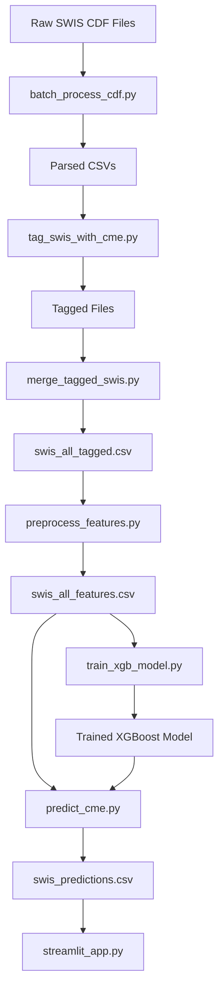
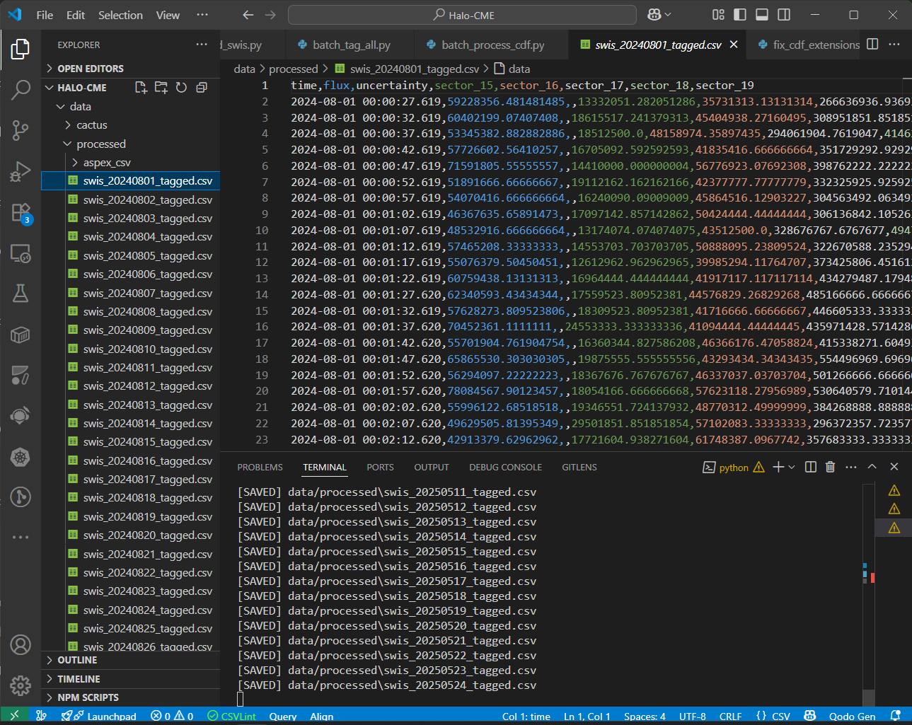

# ☀️ Halo CME Event Prediction from SWIS-ASPEX Particle Data

This project focuses on predicting **Halo Coronal Mass Ejection (CME) events** using particle data from the **SWIS-ASPEX payload onboard Aditya-L1**. Halo CMEs are significant due to their potential to trigger geomagnetic storms affecting satellites, power grids, and communications on Earth.

---

## 🚀 Problem Statement

To build a system that can detect and predict **Halo CME events** by aligning CACTUS-detected events with real-time particle data (flux, sector, etc.) from SWIS-ASPEX. The goal is to:
- Align historical halo CME events with particle patterns
- Train a model that learns from these alignments
- Predict upcoming halo CME events from live or batch particle data

---

## 🔧 Technology Stack

| Layer            | Technology Used                   |
|------------------|-----------------------------------|
| Language         | Python                            |
| Data Processing  | pandas, numpy                     |
| ML Models        | scikit-learn, XGBoost             |
| Imbalance Fix    | imbalanced-learn (SMOTE)          |
| Dashboard        | Streamlit                         |
| File Handling    | netCDF4, glob                     |
| Plotting         | matplotlib, seaborn               |
| Deployment       | Localhost or any web server       |

---

## 📁 Project Structure

```
Halo-CME/
├── data/
│   ├── raw/             # Raw CDF and CACTUS data
│   ├── processed/       # Cleaned, tagged, merged data
├── models/              # Trained ML models (joblib)
├── scripts/             # All scripts (parsing, training, UI)
│   ├── preprocess_features.py
│   ├── train_cme_model.py
│   ├── train_xgb_model.py
│   ├── predict_cme.py
│   └── streamlit_app.py
├── README.md            # 📄 You are here!
```

---

## 📊 Data Pipeline



---

## 🤖 Model Highlights

- Final Model: **XGBoostClassifier**
- SMOTE balanced dataset (0: 15k, 1: 1.4k)
- F1-Score for Halo CME: **0.36** (⚠️ skewed dataset)
- Accuracy: **~93%**
- Prediction interval: ~30s per row

---

## 📷 Output Preview

> To launch:
```bash
streamlit run scripts/streamlit_app.py
```



---

## 🔮 Future Work

- Incorporate TH1/TH2 angle detectors for richer features
- Use LSTM for sequence learning on particle time series
- Integrate alerts for real-time halo CME event prediction

---

## 🏁 Conclusion

This project builds an end-to-end pipeline from **raw scientific particle data** to a **predictive ML dashboard**. With continued data, we can support early warnings of geomagnetic storms directly from space-based observations.

---

## 📬 Contact

> Built with ☀️ by Yootom_19  
> GitHub: [github.com/Theophilus-victor/Halo-CME](#)

